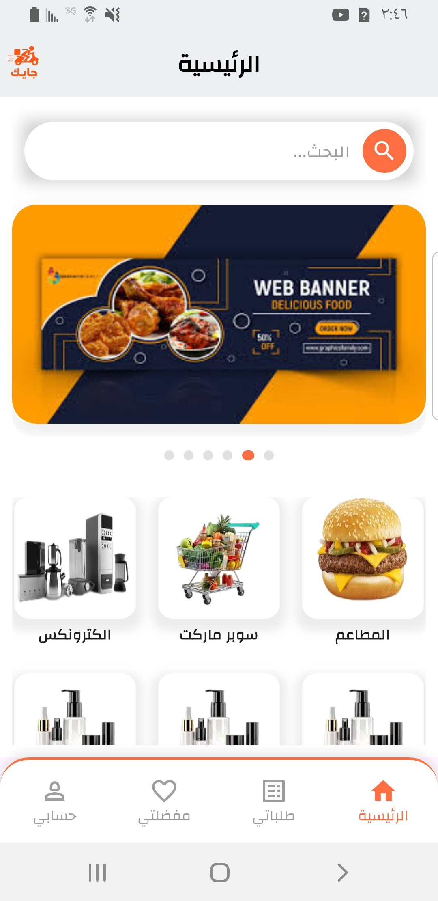
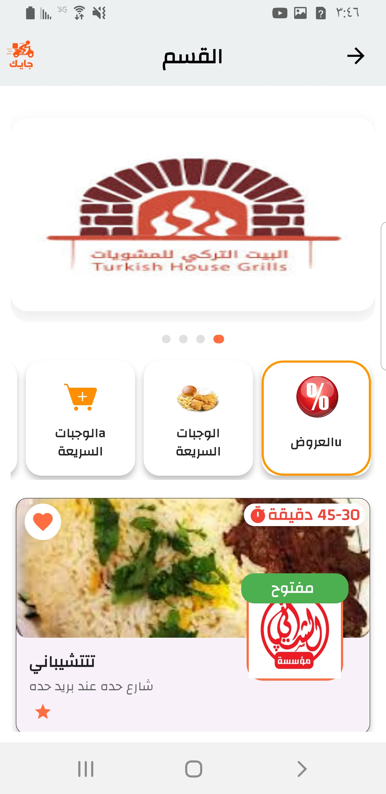
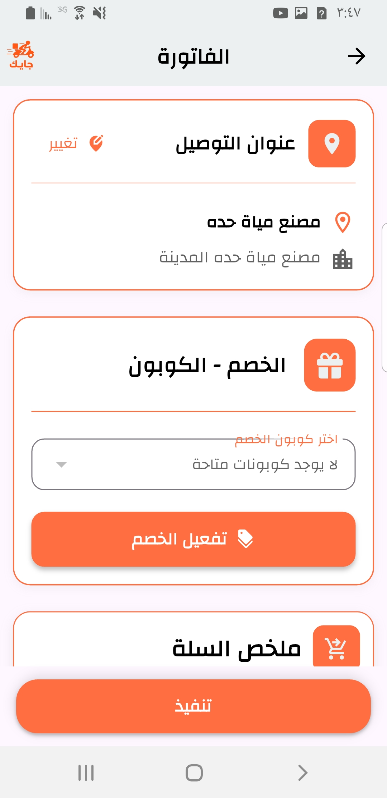

# 🚚 Flutter Delivery App  
**تطبيق توصيل طلبات / Delivery Orders App**

---

## 🏠 نظرة عامة | Overview

تطبيق توصيل طلبات احترافي مبني باستخدام **Flutter** و**GetX** مع ربط كامل بواجهة **Laravel API** ودمج إشعارات **Firebase**.  
يهدف التطبيق إلى تسهيل عملية التوصيل بين المتاجر والعملاء بطريقة مرنة وسهلة، مع تصميم أنيق وتجربة استخدام سلسة.  

A professional **delivery app** built with **Flutter** and **GetX**, fully integrated with **Laravel API** and **Firebase notifications**.  
The app aims to simplify the delivery process between stores and customers with a smooth and elegant user interface.  

---

## 🧩 المميزات | Features

| ✅ بالعربية | ✅ In English |
|-------------|---------------|
| واجهة استخدام احترافية وسهلة | Professional and easy-to-use UI |
| نظام تسجيل دخول المستخدمين والسائقين | User & driver login system |
| إدارة السلة والطلبات في الوقت الفعلي | Real-time cart and orders management |
| متابعة حالة الطلب خطوة بخطوة | Track order status step by step |
| إشعارات فورية عبر Firebase | Instant notifications via Firebase |
| دعم تعدد اللغات (عربي / إنجليزي) | Multi-language support (Arabic / English) |
| ربط كامل مع Laravel API | Full integration with Laravel API |

---

## ⚙️ التقنيات المستخدمة | Technologies Used

| التقنية | الاستخدام | Technology | Purpose |
|----------|------------|-------------|----------|
| **Flutter** | بناء واجهة التطبيق | **Flutter** | UI Development |
| **GetX** | إدارة الحالة والتنقل | **GetX** | State Management & Navigation |
| **Firebase** | الإشعارات (FCM) | **Firebase** | Push Notifications (FCM) |
| **Laravel** | واجهة الـ API وإدارة البيانات | **Laravel** | API & Data Management |
| **MySQL** | قاعدة البيانات | **MySQL** | Database |
| **REST API** | الربط بين الخادم والتطبيق | **REST API** | Communication Layer |

---

## 📸 صور من التطبيق | App Screenshots

| الشاشة الرئيسية | الأقسام | السلة |
|------------------|----------|--------|
|  |  |  |

| تفاصيل المنتج | تفاصيل الطلب | الفاتورة |
|----------------|---------------|-----------|
|  |  |  |

---

## 🧠 هيكلة المشروع | Project Structure

